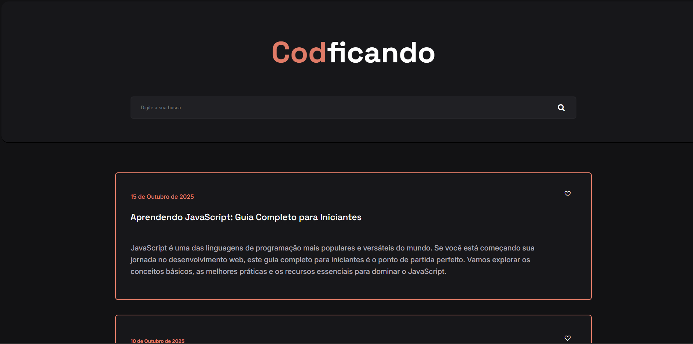

<p align="center">
  
</p>

<h1 align="center">Blog Codficando</h1>

<p align="center">
  <a href="https://github.com/KaduSR/blog-html/blob/main/LICENSE">
    
  </a>
  <a href="https://github.com/KaduSR/blog-html/issues">
    
  </a>
  <a href="https://github.com/KaduSR/blog-html/stargazers">
    
  </a>
</p>

---

## 📝 Índice

- [Sobre o Projeto](#-sobre-o-projeto)
- [✨ Funcionalidades](#-funcionalidades)
- [🚀 Tecnologias Utilizadas](#-tecnologias-utilizadas)
- [🏁 Começando](#-começando)
- [🤝 Como Contribuir](#-como-contribuir)
- [📄 Licença](#-licença)
- [🧑‍💻 Autor](#-autor)

---

## 📖 Sobre o Projeto

**Codficando** é um projeto de blog com um design limpo e moderno, focado em artigos de desenvolvimento web. A interface foi construída utilizando apenas HTML e CSS, demonstrando a criação de layouts responsivos e estilizados sem o uso de frameworks. É um ótimo ponto de partida para iniciantes que desejam entender a estrutura e a estilização de uma página web do zero.

---

## ✨ Funcionalidades

- ✔️ **Layout Responsivo:** A interface se adapta perfeitamente a desktops, tablets e dispositivos móveis.
- ✔️ **Design Moderno:** Utiliza um tema escuro com cores de destaque para uma leitura agradável.
- ✔️ **Componentes Claros:** Organização em cards que separam claramente cada postagem do blog.
- ✔️ **Busca Funcional:** Inclui uma barra de busca estilizada no cabeçalho.
- ✔️ **Fontes Customizadas:** Integração com Google Fonts (Inter e Space Grotesk) para uma tipografia elegante.

---

## 🚀 Tecnologias Utilizadas

Este projeto foi desenvolvido com as seguintes tecnologias:

| Categoria | Tecnologias |
|-----------|-------------|
| Frontend  | HTML5, CSS3 |
| Fontes    | Google Fonts|
| Ícones    | Font Awesome|

---

## 🏁 Começando

Este é um projeto estático, então você não precisa de nenhuma ferramenta complexa para executá-lo.

1. **Clone o repositório:**
   ```bash
   git clone https://github.com/KaduSR/blog-html.git
    ```

2. **Acesse a pasta do projeto:**

    ```bash
    cd blog-html
    ```

Abra o arquivo no navegador:
Basta abrir o arquivo index.html no seu navegador de preferência para ver o projeto funcionando.

---

## 🤝 Como Contribuir

1.  Faça um **Fork** do projeto.
2.  Crie uma nova branch com a sua feature: `git checkout -b feature/sua-feature-incrivel`.
3.  Faça commit das suas alterações: `git commit -m 'feat: Minha nova feature'`.
4.  Envie para a sua branch: `git push origin feature/sua-feature-incrivel`.
5.  Abra um **Pull Request**.

---

## 📄 Licença

Este projeto está sob a licença MIT. Veja o arquivo [LICENSE](LICENSE) para mais detalhes.

---

## 🧑‍💻 Autor

Feito com ❤️ por **Carlos Eduardo da Silva Ribeiro.**